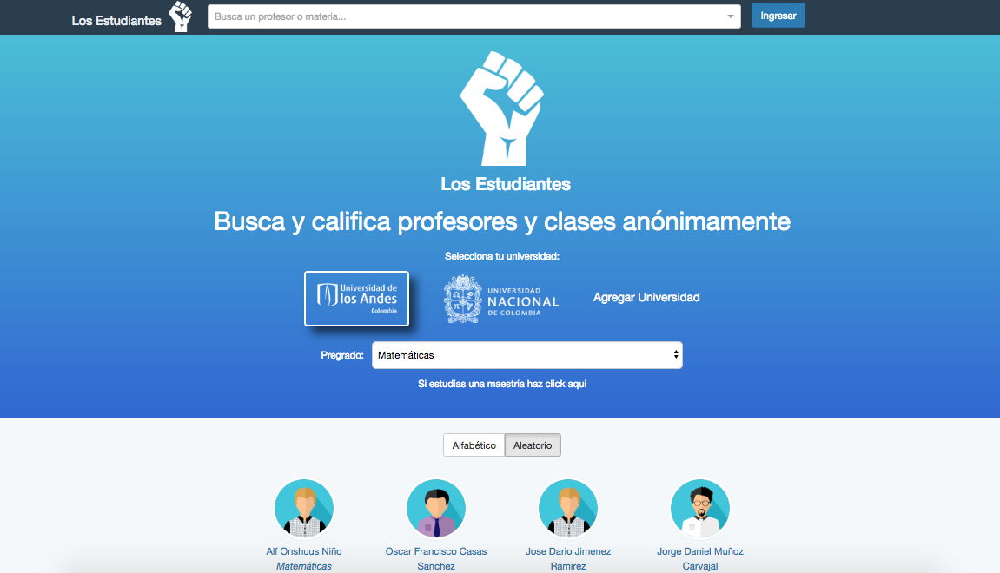
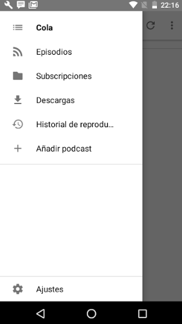
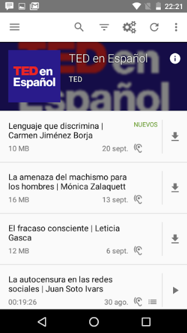

# MISO4208_P1

## 📑  Enunaciado

Usted debe realizar un proceso de pruebas, soportado principalmente en pruebas automatizadas, para la aplicación [losestudiantes](losestudiantes.co) y para la app móvil “AntennaPod” [AntennaPod](https://play.google.com/store/apps/details?id=de.danoeh.antennapod)

Usted debe entregar un archivo .zip con  el documento describiendo el diseño de su proceso de pruebas y su reporte. Adicionalmente debe entregar cualquier artefacto de código que haya sido generado.

---

### Limitaciones

- Se cuenta con 10hrs máquina para realizar el proceso de pruebas sobre los entornos web y móvil.

## Supuestos

- Se cuenta con 1 ingeniero y 10 hrs.
- Máquina de pruebas MacBook Pro con 12Gb de ram, core i5 y 500Gb de disco.
- Celular moto E de 2da generación con sistema operativo Android 6.0

    **NOTA:** El emulador con el dispositvo movil Nexus 5 y Android Oreo no funciona la aplicación. "Aplicación no disponible para este dispositivo".

---

## Aplicaciones

**A. [Los estudiantes](https://losestudiantes.co):** Aplicación web desarrollada con el fin de  darle un espacio a los estudiantes universitarios para que conozcan cuáles materias valen la pena meter y cuáles profesores son los más destacados.

De igual forma, la plataforma web permite a sus usuarios que los estudiantes opienen sobre las materias y diferentes aspectos de los profesores de tal forma que las universidades puedan conocer de primera mano el feedback y resltar a sus mejores profesores.

**B. [AntennaPod](https://play.google.com/store/apps/details?id=de.danoeh.antennapod):** Aplicación móvil para Android que gestiona, almacena y reproduce episodios de podcast. Se tiene acceso a un sinnúmero de opciones de podcast de pago y gratuitos que pueden descargarse que son organizados en listas (Nuevos, Todos y Favoritos).

## Niveles de pruebas

Las pruebas a realizar sobre las aplicaciones (Web y movil) se realizarán a nivel de sistema y aceptación, es decir, se probarán la aplicación como un todo, como un sistema, ambas aplicaciones ya están desarrolladas y finalizadas. Adicionalmente, se realizará

### Sistema

**Manuales**
Las pruebas manuales se realizarán en la medida en que se vaya explorando y descubriendo las distintas funcionalidades de la aplicación móvil, ya que las aplciación Web ya se tiene conocimiento y se reusarán elementos ya presentes para la construcción de la herramienta de prueba automáticas

**Funcionales**
Las pruebas realizadas sobre funciones específicas de la aplicación, representarán los casos de uso a realizar tanto en el app movil como en la aplicación web.

**Automatizadas**
Las pruebas automatizadas serán realizadas con las herramientas:

1. Web los estudiantes:

   Debido al tiempo y a recursos en máquina y personal, se decide por facilidad, eficacia y tiempo, realizar las pruebas con Cypress debido a su integración sencilla y el reuso adecuado de un componente previamente desarrollado para el mismo sitio web.

2. App móvil AnntenaPod:
   El mayor esfuerzo en términos de tiempos y recursos máquina e ingeniero será usado para realizar las pruebas automáticas para la aplicación móvil con monkey testing para android.

## Aceptación

Se realizarán las pruebas sobre las aplicaciones en entornos reales según casos uso descubiertos durante la fase exploratoria. 

**Funcionales**
Pruebas realizadas en la fase exploratoria que determinarán los casos de uso a realizar en la construcción de las pruebas automatizadas.

**Automatizadas**
Se realizarán pruebas automatizadas con las siguientes herramientas

1. App movil AnntenaPdod:
   Se realizarán pruebas automatizadas sobre los casos de uso de búsqueda y suscripción a un nuevo podcast de audio según texto ingresado en la caja de búsqueda. Estos casos de pruebas se realizarán con calabash y se usará cucumber para la descripción de cada uno de los casos de prueba.

--

## Aplicación Web

Se realiza la implementación de las pruebas sobre la aplicación web de [losestudiantes](https://losestudiantes.co) utilizando la herramienta  de [Cypress](https:cypress.io) por su facilidad y fácil implementación a la hora de realizar pruebas automáticas del sistema.

### Ejecutar las pruebas

Situarse en el directorio 'web/'

    $npm install

Después de instalar las dependencias, ejecutar el comando

    $npm run cypress:open

Una vez abierto cypres (UI), seleccionar la ubicación donde se encuentra el archivo de prueba `losestudiantes.spec.js` --->`web/cypress/integration/losestudiantes/losestudiantes.spec.js`

Ejecutar la prueba haciendo clic en "Run all specs" o en el archivo `losestudiantes.spec.js`

