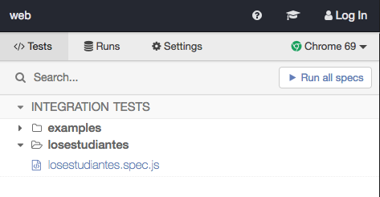

# Pruebas automáticas de la aplicación Web

Se realiza la implementación de las pruebas sobre la aplicación web de [losestudiantes](https://losestudiantes.co) utilizando la herramienta  de [Cypress](https:cypress.io) por su facilidad y fácil implementación a la hora de realizar pruebas automáticas del sistema.

## Ejecutar las pruebas

Situarse en el directorio 'web/'

    $ npm install

Después de instalar las dependencias, ejecutar el comando

    $ npm run cypress:open

Una vez abierto cypres (UI), seleccionar la ubicación donde se encuentra el archivo de prueba `losestudiantes.spec.js` --->`web/cypress/integration/losestudiantes/losestudiantes.spec.js`

Ejecutar la prueba haciendo clic en "Run all specs" o en el archivo `losestudiantes.spec.js`

